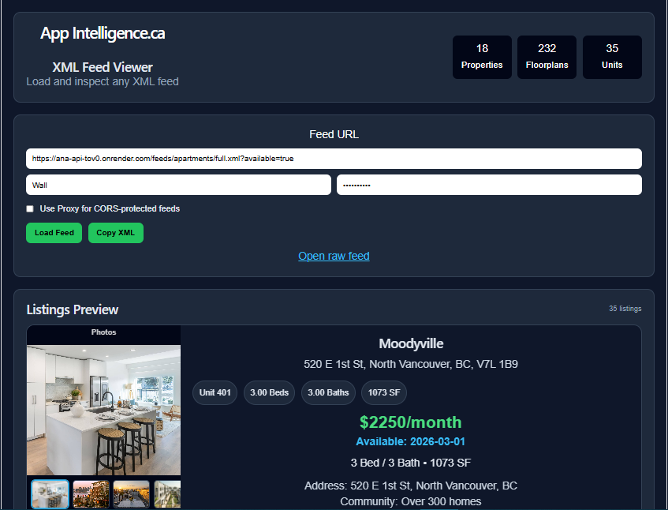

# XML Feed Viewer


## Screenshot



A lightweight XML feed viewer for inspecting and validating property listing feeds, with visual previews, unit breakdowns, and raw XML inspection.

Built to streamline feed QA and improve listing accuracy by turning raw XML into a structured, human-readable interface.

## Features

- Load XML feeds from a URL
- Supports optional Basic Auth credentials
- Optional proxy mode for CORS-protected feeds
- Parses and previews listing data visually
- Displays listing cards, unit table, and raw XML
- Handles both listing-style and MITS-style feed structures
- Includes automated tests for core UI flows

## Tech Stack

- React
- Vite
- JavaScript / JSX
- Vitest
- React Testing Library

## Tested Flows

- Renders app heading
- Shows empty state before loading
- Loads and displays listing data from XML
- Shows error state when fetch fails

## Running Locally

```bash
npm test
npm install
npm run dev

