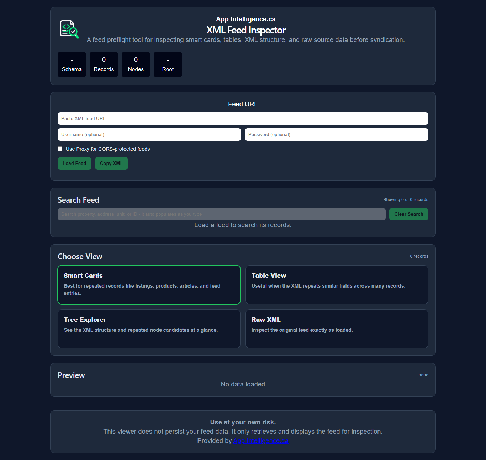

# XML Feed Inspector




XML Feed Inspector is a lightweight feed preflight and QA tool for reviewing property-listing XML before it reaches syndication platforms.

It converts raw XML into a structured, searchable interface so property teams can confirm that changes to units, availability, pricing, promotions, floorplans, and images are present in the live feed before a downstream platform refreshes its listings.

## Features

- Loads live XML feeds from a URL
- Supports optional Basic Authentication credentials
- Includes proxy support for CORS-protected feeds
- Recognizes listing-style, MITS real-estate, and generic XML structures
- Displays every property and available unit inside multi-property MITS feeds
- Provides searchable Smart Card and Table views
- Searches property names, addresses, cities, unit numbers, and identifiers
- Displays bedroom, bathroom, rent, square-footage, availability, and occupancy data
- Displays property, unit, and floorplan identifiers
- Shows promotions, including an explicit `None` state
- Displays unit and floorplan image galleries
- Includes Tree Explorer and complete Raw XML views
- Handles large XML feeds in a scrollable raw-data viewer
- Provides a loading indicator and cold-start notice for sleeping services
- Shows clear authentication and feed-loading errors
- Does not modify Webflow, the Syndicator, or the source feed
- Does not persist feed data in the frontend; it retrieves and displays data for inspection

## Views

### Smart Cards

Visual property and unit cards with images and detailed listing information.

### Table View

A compact comparison of feed records and their available fields.

### Tree Explorer

A structural overview of the XML document and repeated node candidates.

### Raw XML

The complete source feed exactly as retrieved.

## Tech Stack

- React
- Vite
- JavaScript and JSX
- Node.js and Express proxy
- Vitest
- React Testing Library

## Tested Flows

- Renders the welcome screen and application heading
- Shows the empty state before loading a feed
- Dismisses the welcome screen
- Loads and displays listing-style XML data
- Displays units from every property in a MITS container
- Displays complete MITS unit inspection fields
- Handles feeds with and without promotions
- Displays unit and floorplan image galleries
- Displays raw XML feeds larger than 200,000 characters
- Shows an error when a feed request fails

## Running Locally

Install the dependencies:

```bash
npm install
```

Start the frontend:

```bash
npm run dev
```

If the feed requires the proxy, start the proxy server in a second terminal:

```bash
node server.js
```

The frontend uses `http://localhost:10000/proxy-feed` by default. A different endpoint can be configured with:

```env
VITE_PROXY_URL=https://your-proxy.example.com/proxy-feed
```

## Testing

Run the test suite in watch mode:

```bash
npm test
```

Run the test suite once:

```bash
npm run test:run
```

## Privacy and Use

XML Feed Inspector is an inspection tool. It does not edit or publish source data. Users are responsible for confirming that they are authorized to access any feed they inspect.

Use at your own risk.

## Provided By

[App Intelligence.ca](https://appintelligence.ca/)
